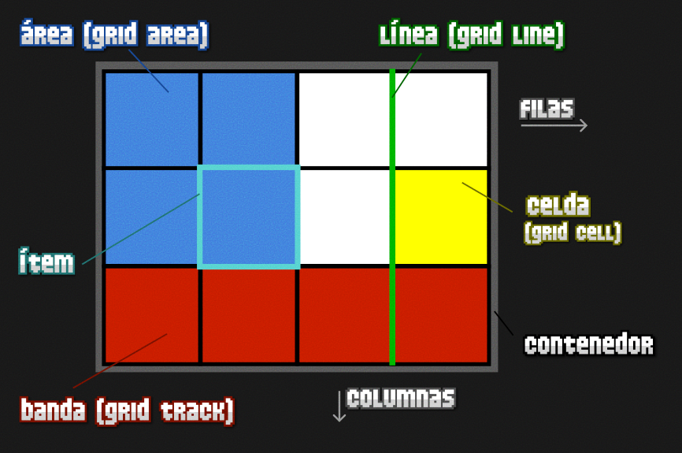
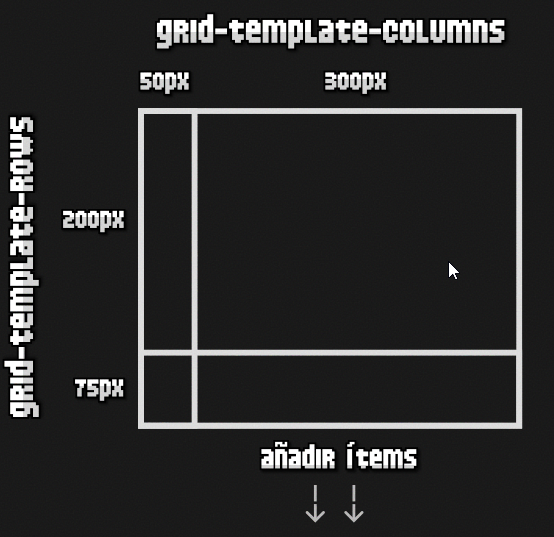

# Uso de Grid y Flex en CSS

## 1. Flex CSS

- Al inicio en CSS se utilizaba para posicionar elementos en la página web (`static`, `relative`, `absolute`…), elementos en línea o en bloque, o la propiedad `float` para realizar maquetaciones, este sistema complica realizar páginas webs modernas, parta distintos dispositivos móviles, escritorio o resolución de pantalla.

> `Flex` o `Flexbox`: sistema de elementos flexible, permite que los elementos HTML se adapten y colocan automáticamente y  es más fácil personalizar el diseño de una pagina web.
Flex crea estructuras de una sola dimensión mediante CSS.

### 1.1. Conceptos de Flex

- **Contenedor**: Es el elemento padre que tendrá en su interior cada uno de los ítems flexibles. Observa que al contrario que muchas otras estructuras CSS, por norma general, en Flex establecemos las propiedades al elemento padre.

  - Eje **principal**: Los contenedores flexibles tendrán una orientación principal específica. Por defecto, el eje principal del contenedor flex es en horizontal (en fila).

  - Eje **secundario**: De la misma forma, los contenedores flexibles tendrán una orientación secundaria, perpendicular a la principal. Si la principal es en horizontal, la secundaria será en vertical (y viceversa).

- **Ítem**: Cada uno de los hijos que tendrá el contenedor en su interior.

Para activar el modo flex, utilizaremos sobre el elemento contenedor la propiedad `display`, y especificaremos el valor `flex` o `inline-flex`

| Tipo de elemento | Descripción                                                                 |
|------------------|------------------------------------------------------------------------------|
| `inline-flex`    | Establece un contenedor en línea, similar a `inline-block` (ocupa solo el contenido). |
| `flex`           | Establece un contenedor en bloque, similar a `block` (ocupa todo el ancho del padre). |

### 1.2. Dirección de los ejes

| Propiedad       | Valor                                   | Significado                             |
|-----------------|------------------------------------------|-----------------------------------------|
| `flex-direction`| `row` \| `row-reverse` \| `column` \| `column-reverse` | Cambia la orientación del eje principal. |

- Mediante la propiedad `flex-direction` podemos modificar la dirección del eje principal del contenedor para que se oriente en **horizontal** (valor por defecto) o en **vertical.** 
- También podemos incluir el sufijo `-reverse` para indicar que coloque los **ítems en orden inverso**.

| Valor           | Descripción                                                   |
|-----------------|----------------------------------------------------------------|
| `row`           | Establece la dirección del eje principal en horizontal.        |
| `row-reverse`   | Establece la dirección del eje principal en horizontal invertido. |
| `column`        | Establece la dirección del eje principal en vertical.          |
| `column-reverse`| Establece la dirección del eje principal en vertical invertido. |

```css
.container{
    display: flex;
    flex-direction: row;
    background: steelblue;
    padding-bottom: 10px;
    padding-top: 10px;
    padding-left: 10px;
    padding-right: 10px;
    margin-top: 20px;

}

.item{
    background-color: grey;
    height:300px ;
    width: 300px;
    margin-left: 6px;
    margin-top: 6px;
}
```

### 1.3. Contenedor flex multilínea

- flex se suele utilizar para estructuras de una sola dimensión, es decir, contenedores que sólo van en una dirección.
- Por defecto, si un elemento no cabe dentro de nuestro contenedor flex, los elementos se harán más pequeños **(son flexibles)** para ajustarlos al contenedor.
- Con la propiedad `flex-wrap` podemos cambiar este comportamiento y permitir que nuestro contenedor flex se desborde, convirtiéndose en un **contenedor flex multilínea.**

| Propiedad   | Valor                            | Significado                                      |
|-------------|----------------------------------|--------------------------------------------------|
| `flex-wrap` | `nowrap` \| `wrap` \| `wrap-reverse` | Evita o permite el desbordamiento (multilínea). |

| Valor          | Descripción                                                                 |
|----------------|------------------------------------------------------------------------------|
| `nowrap`       | Los ítems se ajustan para ocupar el tamaño del contenedor (no permite desbordamiento en múltiples líneas). |
| `wrap`         | Establece los ítems en modo multilínea (permite que se desborde el contenedor). |
| `wrap-reverse` | Establece los ítems en modo multilínea, pero en dirección inversa.          |

- En el caso de especificar `nowrap` (u omitir la propiedad flex-wrap) en el contenedor, los 3 ítems se mostrarían en una misma línea del contenedor (que es el comportamiento por defecto)

#### Atajo: Direccion ejes

- existe una propiedad de atajo llamada `flex-flow`, con la que podemos resumir los valores de las propiedades `flex-direction` y `flex-wrap`, especificándolas en una sola propiedad y ahorrándonos utilizar las propiedades concretas:

```css
.container {
  /* flex-flow: <flex-direction> <flex-wrap>; */
  flex-flow: row wrap;
}
```

## 1.4. Huecos (Gaps)

- `row-gap` y `column-gap`. Dichas propiedades, permiten establecer el tamaño de un **«hueco»** entre ítems desde el elemento padre contenedor, y que eliminan la necesidad de estar utilizando `padding` o `margin` en los elementos hijos, con las complicaciones que ello suele conllevar.
  
| Propiedad     | Valor     | Descripción                                                             |
|---------------|-----------|--------------------------------------------------------------------------|
| `row-gap`     | `normal`  | Espacio entre filas (solo funciona con `flex-direction: column`).       |
| `column-gap`  | `normal`  | Espacio entre columnas (solo funciona con `flex-direction: row`).       |

- flex es un sistema para diseños de una sola dimensión, sólo una de las dos propiedades tendrá efecto.

# 2. Alineación de elementos
- las siguientes propiedades, donde algunas actuan en el eje principal 1️⃣ (recordemos que por defecto es el horizontal), mientras que otras actuan en el eje secundario 2️⃣ (por defecto, el eje vertical):

| Propiedad        | Valor                                                                 | Actúa en eje       |
|------------------|-----------------------------------------------------------------------|--------------------|
| `justify-content`| `start` \| `end` \| `center` \| `space-between` \| `space-around` \| `space-evenly` | Eje principal (1️⃣) |
| `align-items`    | `start` \| `end` \| `center` \| `stretch` \| `baseline`               | Eje secundario (2️⃣) |
| `align-content`  | `start` \| `end` \| `center` \| `space-between` \| `space-around` \| `space-evenly` \| `stretch` | Eje secundario (2️⃣, solo si hay múltiples líneas) |

> La última propiedad, `align-content` solo tiene efecto si tenemos un contenedor **flex multilinea.**

**Antes de comenzar con la alineación de elementos, un pequeño resumen:**
- `justify-content`: Se utiliza para alinear los ítems del eje principal **(por defecto, el horizontal).**
- `align-items`: Usada para alinear los ítems del eje secundario **(por defecto, el vertical).**
- `align-content`: Se utiliza para alinear el contenido del eje secundario entre líneas **(sólo en contenedor multilinea).**

## 2.1. La propiedad `justify-content`

- colocar los ítems de un contenedor mediante una disposición concreta a lo largo del eje principal (por defecto, en horizontal).

| Valor           | Descripción                                                                 |
|-----------------|------------------------------------------------------------------------------|
| `start`         | Agrupa los ítems al inicio del eje principal.                               |
| `end`           | Agrupa los ítems al final del eje principal.                                |
| `center`        | Agrupa los ítems al centro del eje principal.                               |
| `space-between` | Distribuye los ítems dejando espacio entre ellos.                           |
| `space-around`  | Distribuye los ítems dejando espacio alrededor de ellos.                    |
| `space-evenly`  | Distribuye como `space-around`, pero con un espacio exactamente igual alrededor de ellos. |


## 2.2. La propiedad `align-items`

- Se encarga de alinear los ítems en el eje secundario del contenedor.
- Hay que tener cuidado de no confundir `align-items` con `align-content`, puesto que el segundo actúa sobre cada una de las líneas de un contenedor multilinea (no tiene efecto si no usamos `flex-wrap`)

| Valor    | Descripción                                                                 |
|----------|------------------------------------------------------------------------------|
| `start`  | Alinea los ítems al inicio del eje secundario.                              |
| `end`    | Alinea los ítems al final del eje secundario.                               |
| `center` | Alinea los ítems al centro del eje secundario.                              |
| `stretch`| Alinea los ítems estirándolos de modo que cubran desde el inicio hasta el final del contenedor. |
| `baseline` | Alinea los ítems en el contenedor según la base del contenido de los ítems del contenedor. |

# 3. Alineación multilínea

-  Nos servirá cuando estemos tratando con un contenedor **flex multilinea** creado mediante `flex-wrap`. Los contenedores multilinea son un tipo de contenedor en el que, cuando los ítems no caben en el ancho disponible, el eje principal se divide en múltiples líneas.
  
## 3.1. La propiedad `align-content`

- `align-content` servirá para alinear cada una de las líneas del contenedor multilinea. 


| Valor           | Descripción                                                                 |
|-----------------|------------------------------------------------------------------------------|
| `start`         | Agrupa los ítems al inicio del eje principal.                               |
| `end`           | Agrupa los ítems al final del eje principal.                                |
| `center`        | Agrupa los ítems al centro del eje principal.                               |
| `space-between` | Distribuye los ítems desde el inicio hasta el final.                        |
| `space-around`  | Distribuye los ítems dejando el mismo espacio a los lados de cada uno.      |
| `stretch`       | Estira los ítems para ocupar de forma equitativa todo el espacio.           |

## 3.2. La propiedad align-self

- `align-self` nos permite cambiar el comportamiento de `align-items` y sobreescribirlo con comportamientos específicos para ítems concretos que no queremos que se comporten igual que el resto.

| Propiedad   | Valores                                      | Actúa en eje |
|-------------|----------------------------------------------|--------------|
| `align-self`| `auto`  `start`  `end`  `center`  `stretch`  `baseline` | 2️⃣ (eje cruzado) |

# 4. Grid CSS

-  `grid` permite crear rápidamente cuadrículas flexibles y potentes de forma prácticamente instantánea con una nueva familia de propiedades CSS.

## 4.1. Conceptos de Grid



- **Contenedor:** El elemento padre contenedor que definirá la cuadrícula o rejilla.
- **Ítem:** Cada uno de los hijos que contiene la cuadrícula (elemento contenedor).
- **Celda (grid cell):** Cada uno de los cuadritos (unidad mínima) de la cuadrícula.
- **Area (grid area):** Región o conjunto de celdas de la cuadrícula.
- **Banda (grid track):** Banda horizontal o vertical de celdas de la cuadrícula.
- **Línea (grid line):** Separador horizontal o vertical de las celdas de la cuadrícula.

- Para activar la cuadrícula grid hay que utilizar sobre el elemento contenedor la propiedad `display` y especificar uno de los dos valores que queramos utilizar: `grid` o `inline-grid`.

| Tipo de elemento | Descripción                                                                 |
|------------------|-----------------------------------------------------------------------------|
| `inline-grid`    | Establece una cuadrícula con ítems en línea, de forma equivalente a `inline-block`. |
| `grid`           | Establece una cuadrícula con ítems en bloque, de forma equivalente a `block`.       |

## 4.2. Definir filas y columnas
### Filas y columnas fijas

- la forma principal de definir una cuadrícula es indicar el tamaño de sus filas y sus columnas de forma explícita. Para ello, con propiedades CSS `grid-template-columns` y `grid-template-rows`:

| Propiedad              | Valor                 | Descripción                                              |
|------------------------|-----------------------|----------------------------------------------------------|
| `grid-template-columns`| `[col1] [col2] ...`   | Establece el tamaño y número de columnas de la cuadrícula. |
| `grid-template-rows`   | `[fila1] [fila2] ...` | Establece el tamaño y número de filas de la cuadrícula.    |

```css
.grid {
  display: grid;
  grid-template-columns: 50px 300px;
  grid-template-rows: 200px 75px;
}
```
- Con la propiedad `display`: grid definimos que queremos crear un grid, y mediante las propiedades `grid-template-columns` y `grid-template-rows` definimos los tamaños de las columnas y las filas del mismo.
  - Esto significa que, a priori, tendríamos una cuadricula o grid de 4 celdas en total: 



## 4.3. Unidad fracción restante (fr)

> 🔹 `1fr` NO tiene un valor fijo en píxeles.

- El valor de `1fr` **(una fracción)** en CSS Grid depende del espacio disponible en el contenedor. Así que su tamaño cambia dinámicamente según:
  - el tamaño total del contenedor,
  - el número de columnas/filas fraccionadas,
  - el tamaño de otros elementos fijos (en `px`, `%`, etc.),
  - márgenes, paddings, gaps, etc.

### EJEMPLO:

```css
.container {
  display: grid;
  grid-template-columns: 1fr 2fr;
  width: 600px;
}
```

- `1fr` + `2fr` = `3fr`, que se repartirán el espacio restante del contenedor.

  - En este caso, `1fr` = `200px`, `2fr` = `400px`.

- Pero si el contenedor tuviera `width: 300px`, entonces:

  - `1fr` = `100px`, `2fr` = `200px`.